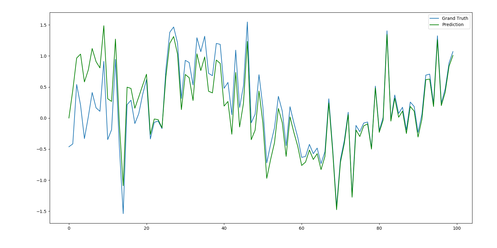
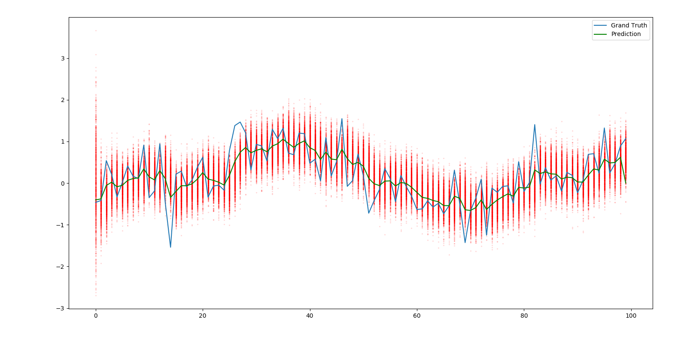

filter
==
# Overview
フィルター系まとめ

# Discription
- Kalman Filter : モデルが線形かつノイズがガウス分布に従う
- Extended Kalman Filter : モデルが線形/非線形かつノイズがガウス分布
- 
# Data

# Results
## Kalman Filter

## Particle Filter

# Cite
## Kalman Filter
- [シンプルなモデルとイラストでカルマンフィルタを直観的に理解してみる](https://qiita.com/MoriKen/items/0c80ef75749977767b43)
- [カルマンフィルタ実装](https://satomacoto.blogspot.com/2011/06/python.html)

## Particle Filter
- [データ & Particle filter理論](https://qiita.com/kenmatsu4/items/c5232b1499dfd00e877d)
- [particle filter 実装](https://github.com/matsuken92/Qiita_Contents/blob/master/particle_filter/particle_filter_class.ipynb)

## その他
- [状態空間モデルの推定方法の分類](https://logics-of-blue.com/%E7%8A%B6%E6%85%8B%E7%A9%BA%E9%96%93%E3%83%A2%E3%83%87%E3%83%AB%E3%81%AE%E6%8E%A8%E5%AE%9A%E6%96%B9%E6%B3%95%E3%81%AE%E5%88%86%E9%A1%9E/)